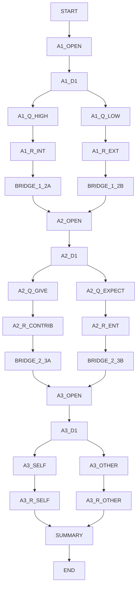

```mermaid
flowchart TD
    START --> A1_OPEN
    A1_OPEN --> A1_D1
    A1_D1 --> A1_Q_HIGH --> A1_R_INT --> BRIDGE_1_2A --> A2_OPEN
    A1_D1 --> A1_Q_LOW --> A1_R_EXT --> BRIDGE_1_2B --> A2_OPEN

    A2_OPEN --> A2_D1
    A2_D1 --> A2_Q_GIVE --> A2_R_CONTRIB --> BRIDGE_2_3A --> A3_OPEN
    A2_D1 --> A2_Q_EXPECT --> A2_R_ENT --> BRIDGE_2_3B --> A3_OPEN

    A3_OPEN --> A3_D1
    A3_D1 --> A3_SELF --> A3_R_SELF --> SUMMARY --> END
    A3_D1 --> A3_OTHER --> A3_R_OTHER --> SUMMARY
```